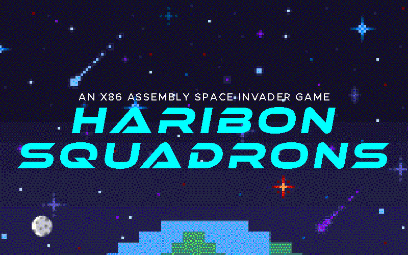

<!-- PROJECT LOGO -->
<br />
<p align="center">
  <p align="center">
    
  </p>

  <p align="center">
    Haribon Squadrons is a nostalgic space Alien-like game themed around Pamantasan ng Lungsod ng Maynila (PLM) and is written in the old x86 Assembly Language.
    <br />
</p>

<!-- TABLE OF CONTENTS -->
<details open="open">
  <summary><h2 style="display: inline-block">Table of Contents</h2></summary>
  <ol>
    <li>
      <a href="#-about-the-project">About The Project</a>
    </li>
    <li>
      <a href="#-getting-started">Getting Started</a>
      <ul>
        <li><a href="#prerequisites">Prerequisites</a></li>
        <li><a href="#installation">Installation</a></li>
      </ul>
    </li>
    <li><a href="#-disclaimer">Disclaimer</a></li>
  </ol>
</details>

<!-- ABOUT THE PROJECT -->

## 💡 About The Project

This repository contains the source code for Haribon Squadrons, a space Alien-like game themed around Pamantasan ng Lungsod ng Maynila (PLM). Developed as a submission for our finals project in the course Computer Architecture and Organization, this game showcases our skills in x86 assembly language programming and our creativity.

  <summary><h2 style="display: inline-block">⚙ Technology Used</h2></summary>
  <ol>
    <li>
      Assembly Language: The game is written entirely in x86 assembly language, showcasing our ability to program at a low level.
    </li>
    <li>
      Assembler: We used Turbo Assembler to compile our assembly code.
    </li>
    <li>
      For testing and running the game, we used DOSBox to emulate the x86 environment.
    </li>

  </ol>

## 🆕 Getting Started

- ### **Prerequisites**

  - <a href="https://www.dosbox.com/">DOSBox Emulator</a>
  - TASM Assembler Tools

<!-- GETTING STARTED -->

- ### **Installation**

1. **Clone the Repository**:

   ```bash
   git clone https://github.com/vinnyy-ph/Haribon-Squadron.git
   ```

2. **Change the directory to the repository**:

   ```bash
   cd C:\Haribon-Squadron
   ```

3. **Compile the main assembly file using TASM**:

   ```
   tasm /zi main.asm
   tlink /v main.obj
   ```

4. **Run the compiled program in DOSBox emulator**:
   ```
   main.exe
   ```

## ❗❗ Disclaimer

This project was developed as part of our coursework for Computer Architecture and Organization at Pamantasan ng Lungsod ng Maynila (PLM). It is intended for educational purposes only and may not be suitable for production use.

Updates and Maintenance: This project was created as a one-time submission for a course requirement. As such, we may not actively maintain or update the repository. However, we welcome forks and further development by the community.
